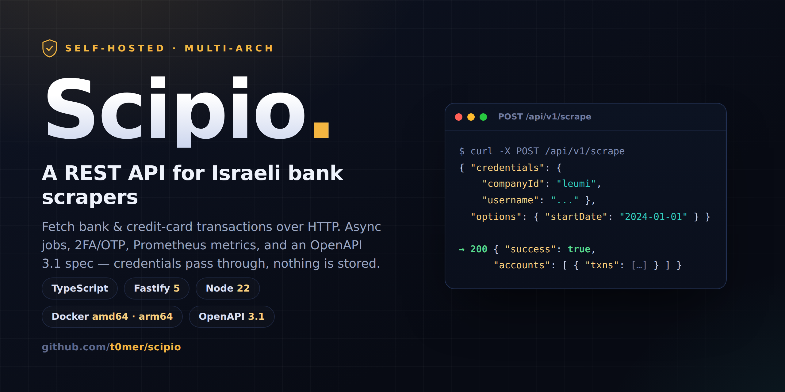
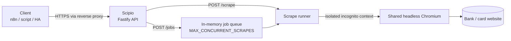

# Scipio

[](https://github.com/t0mer/scipio/actions/workflows/ci.yml)
[](https://hub.docker.com/r/techblog/scipio)
[](https://github.com/t0mer/scipio/releases)
[](./LICENSE)



A self-hosted **RESTful API around [israeli-bank-scrapers](https://github.com/eshaham/israeli-bank-scrapers)**.
Fetch Israeli bank and credit-card transactions over HTTP from n8n, Home
Assistant, budgeting importers, or any script, instead of embedding the npm
library in each of them.

Scipio is a **stateless proxy** in front of the banks. Credentials pass through
per request and are **never persisted and never logged**.

> **Disclaimer.** Scipio is an unofficial project. It is not affiliated with,
> endorsed by, or supported by any bank or credit-card company, or by the
> authors of israeli-bank-scrapers. Use it at your own risk. Banks may lock
> accounts after repeated failed logins. Credentials go to **your own server**
> only. See [Security model](#security-model).

## Table of contents

- [Features](#features)
- [How it works](#how-it-works)
- [Requirements](#requirements)
- [Quick start](#quick-start)
- [Configuration](#configuration)
- [Authentication](#authentication)
- [API](#api)
- [Supported companies](#supported-companies)
- [Jobs and 2FA](#jobs-and-2fa)
- [Result and error model](#result-and-error-model)
- [Security model](#security-model)
- [Observability](#observability)
- [Troubleshooting](#troubleshooting)
- [Development](#development)
- [Contributing](#contributing)
- [Credits](#credits)
- [License](#license)

---

## Features

- The library's scrape features over REST: all 18 companies, scrape options,
  opt-in features, future debits, progress events, and OneZero 2FA. The server
  controls the browser settings and the failure-screenshot path
  (`FAILURE_SCREENSHOTS_DIR`); page callbacks such as `preparePage` are not
  exposed.
- Synchronous scrape **and** asynchronous jobs (a scrape takes about 30s to 3min).
- Interactive **2FA/OTP** flow for OneZero, plus helpers to obtain a reusable
  long-term token.
- Per-company credential validation. Credentials are a discriminated union keyed
  by `companyId`, so a wrong field set is rejected with a clear message.
- OpenAPI 3.1 spec and Swagger UI, generated from the route schemas.
- Bearer-token auth, per-endpoint rate limiting, and a bounded job queue.
- Prometheus metrics, health and readiness probes.
- A single multi-arch container (`linux/amd64`, `linux/arm64`) with system
  Chromium and Hebrew fonts, running as a non-root user.

## How it works



- One headless Chromium is launched on first use and shared. Every scrape gets
  its own isolated browser context, which is closed when the scrape ends.
- Scrapes run through
  [`israeli-bank-scrapers-core`](https://www.npmjs.com/package/israeli-bank-scrapers-core)
  (the variant of the library that uses an existing Chromium instead of
  downloading one).
- Jobs and their results live **in memory only**. They are lost on restart, and
  they are not shared between replicas.

## Requirements

- **Docker** (recommended), for `linux/amd64` or `linux/arm64`, or
- **Node.js 22+** and a Chromium binary, to run from source.
- Valid online-banking credentials for the accounts you want to scrape.

## Quick start

### Docker

```bash
docker run -d --name scipio \
  -p 8080:8080 \
  --shm-size=1g \
  -e API_TOKENS=change-me-please \
  techblog/scipio:latest
```

Open Swagger UI at <http://localhost:8080/docs>.

> `--shm-size=1g` is recommended. Scipio always starts Chromium with
> `--disable-dev-shm-usage`, so it does not depend on `/dev/shm`, but the extra
> shared memory does no harm and gives Chromium headroom.

> Always set `API_TOKENS` when running in Docker. Without tokens Scipio binds to
> `127.0.0.1` inside the container, so the published port is unreachable (see
> [Binding safety](#binding-safety)).

Published image tags on Docker Hub: `latest` and date-based versions such as
`2026.9.0`. Scipio is not published to npm or GHCR. (The npm package named
`scipio` is an unrelated project.)

### Docker Compose

```bash
cp .env.example .env   # set API_TOKENS
docker compose up -d
```

[`docker-compose.yml`](./docker-compose.yml) pulls `techblog/scipio:latest` and
sets up:

- a named volume `scipio-data` mounted at `/data` (for optional failure screenshots);
- `shm_size: 1gb`;
- hardening: `cap_drop: [ALL]` and `no-new-privileges`;
- `restart: unless-stopped`.

The compose file reads only `API_TOKENS` from `.env`. To change any other
setting, add it under `environment:` in `docker-compose.yml`.

### From source

```bash
npm ci
npm run dev        # watch mode (tsx)
# or
npm run build && npm start
```

Requires **Node.js 22+** and a Chromium binary. Set `CHROMIUM_PATH` if it is not
at `/usr/bin/chromium`.

### Image details

| Item | Value |
|---|---|
| Base | `node:22-bookworm-slim` + Debian `chromium`, Noto fonts (Hebrew), `dumb-init` |
| User | `scipio` (UID 10001), non-root |
| Port | `8080` |
| Volume | `/data` (writable by `scipio`) |
| Timezone | `TZ=Asia/Jerusalem` |
| Health check | `GET /healthz` every 30s |
| Default Chromium args | `CHROMIUM_ARGS=--no-sandbox` (see [Troubleshooting](#troubleshooting)) |

---

## Configuration

All configuration is via environment variables (12-factor). Precedence:
`ENV` → built-in default. There are no CLI flags or config files. Invalid
configuration (a non-numeric or out-of-range value, an unknown log level) fails
fast at boot with a list of every problem.

| Variable | Default | Purpose |
|---|---|---|
| `PORT` | `8080` | HTTP port (1–65535) |
| `BIND` | `0.0.0.0` | Bind address (see [Binding safety](#binding-safety)) |
| `API_TOKENS` | — | Comma-separated API tokens. Empty disables auth. |
| `ALLOW_INSECURE` | `false` | Keep a non-loopback bind without tokens |
| `MAX_CONCURRENT_SCRAPES` | `2` | Async jobs that run at the same time (min 1) |
| `QUEUE_LIMIT` | `20` | Queued (not yet running) jobs before `POST /jobs` returns `429` |
| `JOB_RESULT_TTL_SECONDS` | `900` | How long a finished job and its result are kept |
| `SYNC_SCRAPE_TIMEOUT_SECONDS` | `240` | Response timeout for `POST /scrape` (`504` after it) |
| `OTP_WAIT_TIMEOUT_SECONDS` | `300` | How long a job waits in `waiting_for_otp`; also the lifetime of a `/2fa/trigger` session |
| `CHROMIUM_PATH` | `/usr/bin/chromium` | Chromium executable used by Puppeteer |
| `CHROMIUM_ARGS` | — (image: `--no-sandbox`) | Extra Chromium launch args, comma or space separated |
| `FAILURE_SCREENSHOTS_DIR` | — | When set, a failed scrape saves a screenshot here |
| `LOG_LEVEL` | `info` | `fatal`, `error`, `warn`, `info`, `debug`, `trace` or `silent` |
| `RATE_LIMIT_MAX` | `10` | Requests per window on each rate-limited endpoint |
| `RATE_LIMIT_WINDOW_SECONDS` | `900` | Rate-limit window (15 min) |

Boolean values accept `true`/`false`, `1`/`0`, `yes`/`no`, `on`/`off`.
Chromium is always launched headless with `--disable-dev-shm-usage` in addition
to `CHROMIUM_ARGS`.

Build information (set by the Docker build, shown by `GET /version`):

| Variable | Default | Purpose |
|---|---|---|
| `SCIPIO_VERSION` | `version` from `package.json` | Reported service version |
| `GIT_COMMIT` (or `COMMIT`) | `unknown` | Reported git commit |

### Binding safety

If `API_TOKENS` is empty, Scipio will not expose an unauthenticated API on a
non-loopback interface. It changes `BIND` to `127.0.0.1` and logs a warning.
Set `ALLOW_INSECURE=true` to keep a public bind without tokens (not
recommended). Loopback addresses are `127.0.0.1`, `localhost` and `::1`.

---

## Authentication

When `API_TOKENS` is set, every `/api/v1/*` route needs a token in either
header:

- `Authorization: Bearer <token>`, or
- `X-API-Token: <token>`

A missing or wrong token returns `401` with code `UNAUTHORIZED`.

Public routes (no auth): `/healthz`, `/readyz`, `/version`, `/metrics`, `/docs`,
`/openapi.json`.

If no tokens are configured, `/api/v1` is open (bootstrap mode). This is meant
only for first-run or localhost use.

---

## API

Base path `/api/v1`. Interactive docs at `/docs`, spec at `/openapi.json`.
Request and response samples for every endpoint and company are in
[`examples/`](./examples/README.md).

| Method & path | Purpose | Success | Example |
|---|---|---|---|
| `GET /api/v1/companies` | Companies, login fields, 2FA flag, opt-in features | `200` | [companies](./examples/endpoints/companies.md) |
| `POST /api/v1/scrape` | Synchronous scrape (blocks; not for interactive 2FA) | `200` | [scrape](./examples/endpoints/scrape.md) |
| `POST /api/v1/jobs` | Create an async job → `{ jobId, status }` | `202` | [jobs-create](./examples/endpoints/jobs-create.md) |
| `GET /api/v1/jobs/{jobId}` | Job status, progress events, queue position | `200` | [jobs-get](./examples/endpoints/jobs-get.md) |
| `GET /api/v1/jobs/{jobId}/result` | Full result once the job is finished (`409` before) | `200` | [jobs-result](./examples/endpoints/jobs-result.md) |
| `POST /api/v1/jobs/{jobId}/otp` | Submit an OTP for a `waiting_for_otp` job | `204` | [jobs-otp](./examples/endpoints/jobs-otp.md) |
| `DELETE /api/v1/jobs/{jobId}` | Cancel or delete a job | `204` | [jobs-delete](./examples/endpoints/jobs-delete.md) |
| `POST /api/v1/2fa/trigger` | OneZero: send an OTP to a phone number | `200` | [2fa-trigger](./examples/endpoints/2fa-trigger.md) |
| `POST /api/v1/2fa/long-term-token` | OneZero: exchange the OTP for a long-term token | `200` | [2fa-long-term-token](./examples/endpoints/2fa-long-term-token.md) |
| `GET /healthz` | Liveness → `{ status, version }` | `200` | [healthz](./examples/endpoints/healthz.md) |
| `GET /readyz` | Readiness: Chromium present and launchable (`503` if not) | `200` | [readyz](./examples/endpoints/readyz.md) |
| `GET /version` | `{ version, libraryVersion, commit }` | `200` | [version](./examples/endpoints/version.md) |
| `GET /metrics` | Prometheus metrics | `200` | [metrics](./examples/endpoints/metrics.md) |
| `GET /openapi.json` | OpenAPI 3.1 document | `200` | [openapi](./examples/endpoints/openapi.md) |

`POST /scrape`, `POST /jobs`, `POST /2fa/trigger` and `POST /2fa/long-term-token`
are rate limited: `RATE_LIMIT_MAX` requests per `RATE_LIMIT_WINDOW_SECONDS` on
each endpoint, counted per API token (or per client IP when no token is sent).

### Request body

`POST /scrape` and `POST /jobs` take the same body:

```json
{
  "credentials": { "companyId": "<id>", "...": "company-specific fields" },
  "options": { "startDate": "2024-01-01" }
}
```

Scrape options (only `startDate` is required; unknown fields are rejected):

| Option | Type | Purpose |
|---|---|---|
| `startDate` | string | ISO 8601 date or date-time to fetch transactions from |
| `combineInstallments` | boolean | Combine installment transactions into the first one |
| `futureMonthsToScrape` | integer | Also scrape N months into the future |
| `additionalTransactionInformation` | boolean | Fetch extra info (e.g. category) per transaction; slower |
| `includeRawTransaction` | boolean | Include the raw source transaction (debugging) |
| `verbose` | boolean | Extra debug info in the output |
| `timeout` | integer | Navigation timeout in ms (`0` disables) |
| `defaultTimeout` | integer | Puppeteer default timeout in ms |
| `navigationRetryCount` | integer | Retries on navigation failure |
| `viewportSize` | `{ width, height }` | Browser viewport size |
| `outputData` | `{ enableTransactionsFilterByDate }` | Output filtering |
| `optInFeatures` | string[] | See below |

Opt-in features: `isracard-amex:skipAdditionalTransactionInformation`,
`mizrahi:pendingIfNoIdentifier`, `mizrahi:pendingIfHasGenericDescription`,
`mizrahi:pendingIfTodayTransaction`.

### Example: synchronous scrape (Mizrahi)

For Mizrahi, `username` is your **ID number**.

```bash
curl -sS -X POST http://localhost:8080/api/v1/scrape \
  -H "Authorization: Bearer change-me-please" \
  -H "Content-Type: application/json" \
  -d '{
    "credentials": { "companyId": "mizrahi", "username": "012345678", "password": "secret" },
    "options": { "startDate": "2024-01-01", "combineInstallments": false }
  }'
```

### Example: async job

```bash
# 1) create
JOB=$(curl -sS -X POST http://localhost:8080/api/v1/jobs \
  -H "Authorization: Bearer change-me-please" -H "Content-Type: application/json" \
  -d '{"credentials":{"companyId":"isracard","id":"012345678","card6Digits":"123456","password":"secret"},
       "options":{"startDate":"2024-01-01"}}' | jq -r .jobId)

# 2) poll
curl -sS http://localhost:8080/api/v1/jobs/$JOB \
  -H "Authorization: Bearer change-me-please"

# 3) fetch the result once the status is "succeeded" or "failed"
curl -sS http://localhost:8080/api/v1/jobs/$JOB/result \
  -H "Authorization: Bearer change-me-please"
```

---

## Supported companies

The companies and their login fields come **at runtime from the installed
library** (`GET /api/v1/companies`), so they always match its version.
Credential fields per company:

| Company | `companyId` | Credential fields | Details |
|---|---|---|---|
| Bank Hapoalim | `hapoalim` | `userCode`, `password` | [hapoalim](./examples/companies/hapoalim.md) |
| Bank Leumi | `leumi` | `username`, `password` | [leumi](./examples/companies/leumi.md) |
| Mizrahi Bank | `mizrahi` | `username`, `password` | [mizrahi](./examples/companies/mizrahi.md) |
| Discount Bank | `discount` | `id`, `password`, `num` | [discount](./examples/companies/discount.md) |
| Mercantile Bank | `mercantile` | `id`, `password`, `num` | [mercantile](./examples/companies/mercantile.md) |
| Bank Otsar Hahayal | `otsarHahayal` | `username`, `password` | [otsarHahayal](./examples/companies/otsarHahayal.md) |
| Max | `max` | `username`, `password` | [max](./examples/companies/max.md) |
| Visa Cal | `visaCal` | `username`, `password` | [visaCal](./examples/companies/visaCal.md) |
| Isracard | `isracard` | `id`, `card6Digits`, `password` | [isracard](./examples/companies/isracard.md) |
| Amex | `amex` | `id`, `card6Digits`, `password` | [amex](./examples/companies/amex.md) |
| Union | `union` | `username`, `password` | [union](./examples/companies/union.md) |
| Beinleumi | `beinleumi` | `username`, `password` | [beinleumi](./examples/companies/beinleumi.md) |
| Massad | `massad` | `username`, `password` | [massad](./examples/companies/massad.md) |
| Bank Yahav | `yahav` | `username`, `nationalID`, `password` | [yahav](./examples/companies/yahav.md) |
| Beyahad Bishvilha | `beyahadBishvilha` | `id`, `password` | [beyahadBishvilha](./examples/companies/beyahadBishvilha.md) |
| One Zero | `oneZero` | `email`, `password`, plus `otpLongTermToken` or `phoneNumber` | [oneZero](./examples/companies/oneZero.md) |
| Behatsdaa | `behatsdaa` | `id`, `password` | [behatsdaa](./examples/companies/behatsdaa.md) |
| Pagi | `pagi` | `username`, `password` | [pagi](./examples/companies/pagi.md) |

`card6Digits` must be exactly 6 characters. Extra fields are rejected.

---

## Jobs and 2FA

### Job lifecycle

`queued` → `running` → (`waiting_for_otp` → `running`) → `succeeded` or `failed`

- Up to `MAX_CONCURRENT_SCRAPES` jobs run at once. The rest wait in FIFO order;
  `queuePosition` (0 = next) is shown while a job is queued.
- `progress[]` lists the library's progress events (`INITIALIZING`,
  `LOGGING_IN`, `LOGIN_SUCCESS`, ...) with timestamps.
- A job is `succeeded` when the scraper returned a result, **even if the bank
  rejected the login**. Check `success` and `errorType` in the result. A job is
  `failed` on a timeout (including an OTP that never arrived) or when the
  scrape cannot start (e.g. Chromium fails to launch); the job's `error` field
  then holds `{ code, message }`. Other scraper errors come back as `succeeded`
  with `errorType: GENERIC` in the result.
- A finished job and its result are deleted `JOB_RESULT_TTL_SECONDS` after
  completion. `DELETE /jobs/{jobId}` removes it at once. A queued job is dropped
  before it starts; for a running job, cancelling is best-effort.

### OneZero 2FA

OneZero requires two-factor auth. There are two options.

**A. One-time setup: obtain a reusable long-term token**, then use it for all
scrapes (on `/scrape` or `/jobs`).

```bash
# send an OTP to your phone
curl -sS -X POST http://localhost:8080/api/v1/2fa/trigger \
  -H "Authorization: Bearer change-me-please" -H "Content-Type: application/json" \
  -d '{"companyId":"oneZero","phoneNumber":"972500000000"}'

# exchange the OTP code you received for a long-term token
curl -sS -X POST http://localhost:8080/api/v1/2fa/long-term-token \
  -H "Authorization: Bearer change-me-please" -H "Content-Type: application/json" \
  -d '{"companyId":"oneZero","otpCode":"123456"}'
# -> { "longTermTwoFactorAuthToken": "..." }   (store this client-side)

# scrape using the token
curl -sS -X POST http://localhost:8080/api/v1/scrape \
  -H "Authorization: Bearer change-me-please" -H "Content-Type: application/json" \
  -d '{"credentials":{"companyId":"oneZero","email":"me@example.com","password":"secret",
       "otpLongTermToken":"..."},"options":{"startDate":"2024-01-01"}}'
```

The trigger opens a session that lives for `OTP_WAIT_TIMEOUT_SECONDS`. Only one
OneZero session is kept per server: a new trigger replaces the previous one.
Calling `/2fa/long-term-token` without a live session returns `409`
`NO_2FA_SESSION`; a rejected code returns `400` `OTP_REJECTED`.

**B. Interactive OTP via a job.** Create a job with a `phoneNumber` instead of a
token. The job moves to `waiting_for_otp`; submit the code to resume it. If no
code arrives within `OTP_WAIT_TIMEOUT_SECONDS`, the job fails with `TIMEOUT`.

```bash
JOB=$(curl -sS -X POST http://localhost:8080/api/v1/jobs \
  -H "Authorization: Bearer change-me-please" -H "Content-Type: application/json" \
  -d '{"credentials":{"companyId":"oneZero","email":"me@example.com","password":"secret",
       "phoneNumber":"972500000000"},"options":{"startDate":"2024-01-01"}}' | jq -r .jobId)

# when GET /jobs/$JOB shows status "waiting_for_otp":
curl -sS -X POST http://localhost:8080/api/v1/jobs/$JOB/otp \
  -H "Authorization: Bearer change-me-please" -H "Content-Type: application/json" \
  -d '{"otpCode":"123456"}'
```

`POST /scrape` for OneZero without `otpLongTermToken` returns `422`
`TWO_FACTOR_REQUIRED`, and so does `POST /jobs` without either
`otpLongTermToken` or `phoneNumber`.

---

## Result and error model

- **Scrape success** mirrors the library: `accounts[]` (each with `txns[]`) and
  optional `futureDebits[]`. Amounts that cannot be parsed are returned as
  `null`.
- **Scrape outcomes** (bad password, blocked account, ...) are **not** HTTP
  errors. They return `success: false` with an `errorType` inside the result:
  `INVALID_PASSWORD`, `CHANGE_PASSWORD`, `ACCOUNT_BLOCKED`, `TIMEOUT`,
  `TWO_FACTOR_RETRIEVER_MISSING`, `GENERIC` or `GENERAL_ERROR`.
- **HTTP errors** use one envelope: `{ "error": { "code", "message", "details?" } }`.

| Status | `code` | When |
|---|---|---|
| `400` | `VALIDATION` | Request body failed validation (credential errors name the required fields) |
| `400` | `OTP_REJECTED` | OneZero rejected the OTP on `/2fa/long-term-token` |
| `401` | `UNAUTHORIZED` | Missing or invalid API token |
| `404` | `NOT_FOUND` | Unknown route, or the job does not exist (or was evicted) |
| `409` | `NOT_READY` | Job result requested before the job finished |
| `409` | `NOT_WAITING_FOR_OTP` | OTP submitted to a job that is not waiting for one |
| `409` | `NO_2FA_SESSION` | `/2fa/long-term-token` without a live trigger session |
| `422` | `TWO_FACTOR_REQUIRED` | OneZero request without a usable 2FA method |
| `422` | `UNPROCESSABLE` | Valid shape that cannot be scraped (e.g. an impossible `startDate` on `/scrape`) |
| `429` | `QUEUE_FULL` | `QUEUE_LIMIT` jobs are already queued |
| `429` | `RATE_LIMITED` | Rate limit exceeded |
| `500` | `INTERNAL` | Unexpected error (details are logged, not returned) |
| `504` | `TIMEOUT` | `POST /scrape` exceeded `SYNC_SCRAPE_TIMEOUT_SECONDS` |

---

## Security model

- **Credentials in POST bodies only.** They are never accepted in query strings,
  never echoed in responses, and never written to disk. A job keeps them in
  memory only until it finishes, then they are cleared. Results (which hold
  financial data) are deleted after `JOB_RESULT_TTL_SECONDS`.
- **Never logged.** Fastify does not log request bodies, and pino redaction
  masks credential fields and auth headers if they are ever logged. A canary
  test enforces this.
- **Auth** uses a constant-time API-token comparison. Without tokens, Scipio
  binds to loopback only unless `ALLOW_INSECURE=true`.
- **Tokens are not scoped.** Every valid token has full API access, including
  the jobs created with other tokens. Give tokens only to clients you trust.
- **Rate limiting** on scrape, job and 2FA endpoints, because banks lock accounts
  after repeated failed logins.
- `/metrics` labels are limited to company, status, method and route, and never
  hold credentials. `route` is the route template (e.g. `/api/v1/jobs/:jobId`),
  except for unknown routes, where it is the raw request URL, query string
  included.
- Failure screenshots are opt-in (`FAILURE_SCREENSHOTS_DIR`) and saved to the
  volume as `<jobId>.png` (or `sync-<timestamp>.png`). They are never returned by
  the API, but they may show bank pages, so protect that directory.

### Deployment recommendations

- **Don't expose Scipio to the internet.** Keep it on a private network or VPN,
  reachable only by the services that call it.
- **Use TLS.** Scipio serves plain HTTP. Put it behind a reverse proxy (Caddy,
  Traefik, nginx) that terminates TLS, so credentials are never sent in clear
  text over a network.
- **Always set `API_TOKENS`** with long random values, and keep them out of
  source control.
- `/metrics`, `/docs` and `/openapi.json` are public. Restrict them at the proxy
  if the network is shared.
- Keep the compose hardening (`cap_drop: [ALL]`, `no-new-privileges`) and the
  non-root user.

---

## Observability

Prometheus metrics at `/metrics`:

| Metric | Type | Labels | Meaning |
|---|---|---|---|
| `scipio_scrapes_total` | counter | `company`, `status` | Scrapes by company and outcome |
| `scipio_scrape_duration_seconds` | histogram | `company`, `status` | Scrape duration (buckets 1s–300s) |
| `scipio_queue_depth` | gauge | — | Jobs currently queued |
| `scipio_http_requests_total` | counter | `method`, `route`, `status` | HTTP requests |

Plus the default Node.js and process metrics, prefixed `scipio_`.

For the two `scipio_scrape*` metrics, `status` is `succeeded`, `failed` or
`timeout`. The meaning differs by endpoint:

- `POST /scrape` records `failed` whenever the result has `success: false`
  (for example `INVALID_PASSWORD`), and `timeout` when the request hits
  `SYNC_SCRAPE_TIMEOUT_SECONDS`.
- Jobs record the job status, so a login the bank rejected counts as
  `succeeded`, and only timeouts and scrapes that could not start count as
  `failed`.

For `scipio_http_requests_total`, `status` is the HTTP status code.

Point Prometheus at `/metrics` and build Grafana panels per company and status.

Health endpoints:

- `GET /healthz`: liveness, used by the image's `HEALTHCHECK`.
- `GET /readyz`: `200` when Chromium exists and launches, `503` otherwise.

---

## Troubleshooting

- **API unreachable from the host (Docker)**: `API_TOKENS` is probably empty, so
  Scipio bound to `127.0.0.1` inside the container. Check the startup warning in
  the logs and set `API_TOKENS`.
- **`CHANGE_PASSWORD`**: the bank requires a password change. Log in on the
  bank's site, change it, then retry.
- **`ACCOUNT_BLOCKED`**: too many failed logins. Unblock the account with the
  bank, and avoid aggressive scheduling.
- **Chromium won't launch / arm64**: the image uses **system Chromium** (not
  Puppeteer's download) and sets `CHROMIUM_ARGS=--no-sandbox` by default,
  because a non-root container user has no usable Chromium sandbox (the setuid
  sandbox isn't installed and unprivileged user namespaces are restricted). The
  container is the isolation boundary. To change this, override `CHROMIUM_ARGS`.
  `--shm-size=1g` is still recommended. Outside Docker, set `CHROMIUM_PATH` to your
  Chromium binary; there the default keeps the sandbox on. `GET /readyz` returns
  `503` while Chromium can't be launched.
- **`429 QUEUE_FULL`**: too many jobs are waiting. Raise `QUEUE_LIMIT` or
  `MAX_CONCURRENT_SCRAPES`, or space out requests. **`429 RATE_LIMITED`**: wait
  for the window to pass or adjust `RATE_LIMIT_*`.
- **`504` on `POST /scrape`**: the scrape took longer than
  `SYNC_SCRAPE_TIMEOUT_SECONDS`. Use the async jobs flow for slow banks.
- **`409 NO_2FA_SESSION`**: the trigger session expired
  (`OTP_WAIT_TIMEOUT_SECONDS`) or was replaced by another trigger. Trigger again.
- **Scrape failures after a bank site change**: update the scraper library
  (`israeli-bank-scrapers-core`) first; upstream usually fixes bank breakages
  quickly.

---

## Development

```bash
npm ci
npm run lint         # eslint
npm run typecheck    # tsc --noEmit
npm test             # vitest (scraper layer mocked; no live bank calls)
npm run build        # tsc -> dist/
npm run format       # prettier (format:check to verify)
```

Other scripts: `npm run dev` (watch mode), `npm run lint:fix`,
`npm run test:watch`.

Local smoke test with real credentials (never run in CI). It reads the
credentials from the environment only:

```bash
SCIPIO_CREDENTIALS='{"companyId":"leumi","username":"...","password":"..."}' \
SCIPIO_START_DATE=2024-01-01 \
npm run scrape:manual
```

`SCIPIO_START_DATE` defaults to 30 days ago.

### Project layout

```
src/
  server.ts        entry point: load config, build app, listen
  app.ts           Fastify app: auth, rate limit, errors, swagger, routes
  services.ts      service wiring (browser, runner, jobs, 2FA, metrics)
  config.ts        env parsing and validation
  metrics.ts       Prometheus registry and metrics
  version.ts       service version, git commit, library version
  http/            auth, error envelope, log redaction, swagger, routes/
  jobs/            in-memory job store (TTL) and queue manager
  schemas/         TypeBox schemas (credentials, options, results, jobs, 2FA)
  scraper/         browser manager, runner, OTP bridge, 2FA manager, companies
scripts/           manual-scrape.ts, next-version.sh
tests/             vitest suites
examples/          request/response samples per company and endpoint
```

### CI

The CI workflow runs on pull requests and on pushes to `main` (or `master`): lint, typecheck
and tests, then an image build with Trivy filesystem and image scans. Snyk and
SonarQube run only when their tokens are configured.

### Releasing

Versioning is date-based `YYYY.M.PATCH` (no leading zero on the month). Releases
are **manual**: run the **Release** workflow (`workflow_dispatch`). Leave the
`version` input blank to auto-compute the next version with
`scripts/next-version.sh`, or set it explicitly. The workflow builds and pushes
the multi-arch image (`techblog/scipio:{version,latest}`, `linux/amd64` and
`linux/arm64`), then tags the commit (as `github-actions[bot]`) and creates a
GitHub release with generated notes. `linux/arm/v7` is not built, because
Chromium with Node 22 on 32-bit ARM is not practical.

---

## Contributing

Issues and pull requests are welcome. Please run `npm run lint`,
`npm run typecheck` and `npm test` before opening a PR. Never include real
credentials, account numbers or scrape output in issues, tests or examples.

## Credits

Scipio is a thin HTTP layer. The scraping itself is done by
[israeli-bank-scrapers](https://github.com/eshaham/israeli-bank-scrapers) and
its contributors.

## License

[Apache-2.0](./LICENSE).
